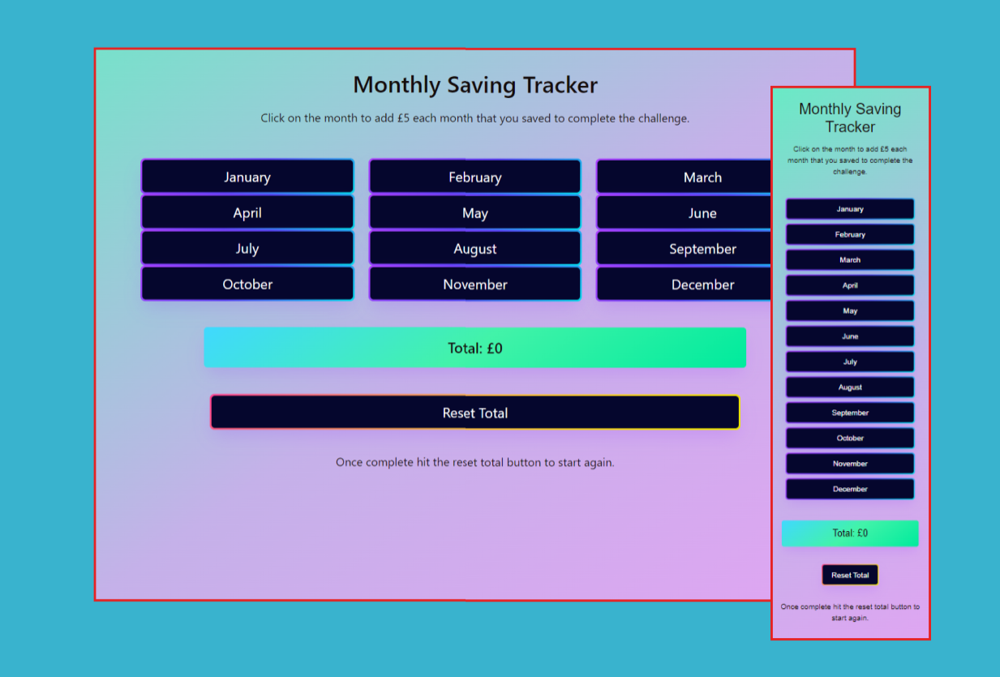
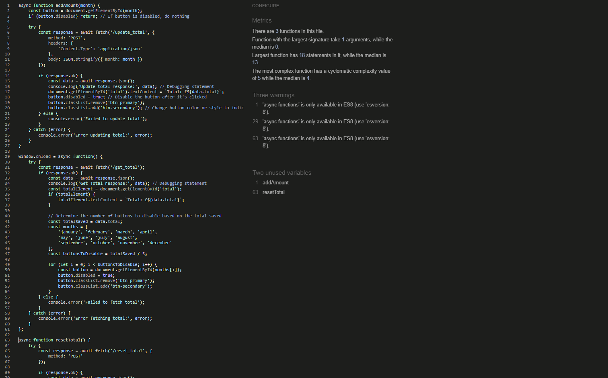

# Ali_Tracks
A web based app to track savings goals
<h1 align="center">Flask App with MongoDB on Heroku</h1>

[View the live project here.](https://ali-tracks-55fe74203334.herokuapp.com/)

This is a Flask-based web application that interacts with a MongoDB database. It includes routes for updating and retrieving totals, and it's designed to demonstrate CRUD operations. The application is deployed on Heroku, making it accessible from anywhere.

<h2 align="center"></h2>

## Table of Contents

1. [User Experience](#user-experience-ux)
   - [User Stories](#user-stories)
   - [Design](#design)

2. [The Final Design](#the-final-design)
   - [Main](#main-page)

3. [Features](#features)
   - [Page Content](#page-content)

4. [Technologies Used](#technologies-used)
   - [Languages Used](#languages-used)
   - [Frameworks, Libraries & Programs Used](#frameworks-libraries--programs-used)

5. [Testing](#testing)
   - [Validation](#validation)
   - [Performance](#performance)
   - [Manual Testing](#manual-testing)
   - [Further Testing](#further-testing)
   - [Further Improvements](#further-improvements)
   - [Testing User Stories from User Experience (UX) Section](#testing-user-stories-from-user-experience-ux-section)
       - [First Time Visitor Goals](#first-time-visitor-goals-1)
       - [Returning Visitor Goals](#returning-visitor-goals-1)
       - [Frequent Visitor Goals](#frequent-user-goals-1)
   - [Known Bugs](#known-bugs)

6. [Deployment](#deployment)
   - [Heroku](#heroku)
   - [Forking The GitHub Repository](#forking-the-github-repository)
   - [Making a Local Clone](#making-a-local-clone)

7. [Credits](#credits)
   - [Code](#code)
   - [Content](#content)
   - [Acknowledgements](#acknowledgements)

## User Experience (UX)

### User Stories

- #### First Time Visitor Goals

    1. As a First Time Visitor, I want to easily understand the main purpose of the application.
    2. As a First Time Visitor, I want to know how to interact with the application.

- #### Returning Visitor Goals

    1. As a Returning Visitor, I want to quickly access the main functionalities.

- #### Frequent User Goals
    1. As a Frequent User, I want to efficiently update and retrieve data without hassle.
    2. As a frequent user, I expect the application to remember my progress.

### Design

- #### Colour Scheme
    - The application uses a professional and clean color scheme to ensure a user-friendly interface.
- #### Typography
    - The application uses a modern and readable font, ensuring good readability across different devices with redundancy fonts.

## The Final Design

### Main Page
- <h2 align="centre"></h2>

### Register Page
- <h2 align="centre"></h2>

### Login Page
- <h2 align="centre"></h2>

### Contact Page
- <h2 align="centre"></h2>

## Features

- Responsive on all device sizes
- Handles multiple users and stores their data seperately
- Interactive elements for data retrieval and updates
- A contact page to leave suggestions and ask questions which are stored in the database to be responded to.

### Page Content

- The main page provides clear instructions on how to interact with the application.
- Users can easily navigate through different functionalities.

## Technologies Used

### Languages Used

- [HTML5](https://en.wikipedia.org/wiki/HTML5)
- [CSS3](https://en.wikipedia.org/wiki/Cascading_Style_Sheets)
- [JavaScript](https://en.wikipedia.org/wiki/JavaScript)
- [Python](https://www.python.org/)

### Frameworks, Libraries & Programs Used

1. [Flask](https://flask.palletsprojects.com/en/2.0.x/)
    - Flask was used as the web framework.
1. [MongoDB](https://www.mongodb.com/)
    - MongoDB was used as the database to store and retrieve data.
1. [Heroku](https://www.heroku.com/)
    - Heroku was used to deploy the application.
1. [Git](https://git-scm.com/)
    - Git was used for version control.
1. [GitHub](https://github.com/)
    - GitHub is used to store the project's code.
1. [Postman](https://www.postman.com/)
    - Postman was used for testing API endpoints.

## Testing

The W3C Markup Validator, W3C CSS Validator, and other validation tools were used to ensure the code is error-free.

### Validation

- [W3C Markup Validator](https://validator.w3.org/)
- [W3C CSS Validator](https://jigsaw.w3.org/css-validator/)
- [JSHint](https://jshint.com/)
- [PEP8](https://snyk.io/code-checker/python/)

-   Using the above mentioned validators the following error logs have been recorded and actioned upon.

    -   index.html error log
        -   
        -   
            
    -   base.html error log
        -   
    
    -   register.html error log
        -   

    -   contact.html error log
        -   

    -   The errors from the HTML code validator regarding this line: link rel="stylesheet" href="{{ url_for('static', filename='assets/style.css') }}" and the jinga lines for 
        extending blocks and end blocks "" is expected because the validator does not understand Jinja2 templating syntax used by Flask. This is not a problem in the actual application, as Flask will correctly render the template before serving it to the client. Therefore, this warning from the HTML validator can safely be ignored.

    -   style.css error log
        -   

    -   script.js error log
        -   

    -   app.py error log
        -   


### Performance

- [Google Lighthouse](https://developers.google.com/web/tools/lighthouse)
    -   
    -   
    -   
    -   
    -   
    -   
    -   
    -       

### Manual Testing

- Each route and functionality has been manually tested for correctness.

### Further Testing

- The application was tested on multiple browsers and devices to ensure compatibility. Browsers tested include Google Chrome, Microsoft Edge, Firefox.

### Further Improvements

- Enhance the user interface with more dynamic elements.
- Add in additional pages with different format saving challenges.
- Add a home page with savings advice rather than begining with the login page.

### Testing User Stories from User Experience (UX) Section

- #### First Time Visitor Goals

    1. As a First Time Visitor, I want to easily understand the main purpose of the application.
        - Clear instructions are provided on the main page.
    2. As a First Time Visitor, I want to know how to interact with the application.
        - The user interface is intuitive and guides the user through the functionalities.
    3. As a First Time Visitor, I want a simple and straightforward way to register an account, login and access my information.

- #### Returning Visitor Goals

    1. As a Returning Visitor, I want to quickly access the main functionalities.
        - The main functionalities are easily accessible from the main page.
    2. As a Returning Visitor, I want to be able to login easily to continue the savings goal.

- #### Frequent User Goals

    1. As a Frequent User, I want to efficiently update and retrieve data without hassle.
        - The application is designed for efficient data management.
    2. As a Frequent User, I want to be able to give feedback and ask questions easily by submitting these in the contact form

### Known Bugs

- There might be occasional connectivity issues with the database, which are being monitored and addressed.

## Deployment

### Heroku

The project was deployed to Heroku using the following steps:

1. Create a new Heroku app:
    - `heroku create`
2. Push the repository to Heroku:
    - `git push heroku master`
3. Set up the necessary environment variables on Heroku for the MongoDB connection.

### Forking the GitHub Repository

By forking the GitHub Repository, you can make a copy of the original repository to view and make changes without affecting the original repository.

1. Log in to GitHub and locate the [GitHub Repository](#)
2. Click on the "Fork" button.

### Making a Local Clone

1. Log in to GitHub and locate the [GitHub Repository](#)
2. Click "Clone or download" and copy the URL.
3. Open Git Bash.
4. Change the current working directory to the location where you want the cloned directory.
5. Type `git clone`, and then paste the URL.

(```bash)
- $ git clone (https://github.com/your-username/repository-name/)

## Credits

### Code

-   [Beautiful CSS buttons examples](https://getcssscan.com/css-buttons-examples): The button styling was used on every button of the page. Button 62 was used in this page.

### Content

-   All content was written by the developer.

### Media

-   All images contained herein are property of the developer

### Acknowledgements

-   My Mentor for continuous helpful feedback.
-   My tutor for his support and guidance throughout the project.
-   My wife for giving me the inspiration for the app and using, trying to break it with repeatedly completeing the challenge, resetting and using her phone to test it on smaller    
    devices.
-   My friend Simon Nightingale who helped me test the project on various platforms and browsers. Various members of a private discord who are developers themselves have tested the 
    app, offered help and suggestions along the way.
-   Tutor support at Code Institute for their support.